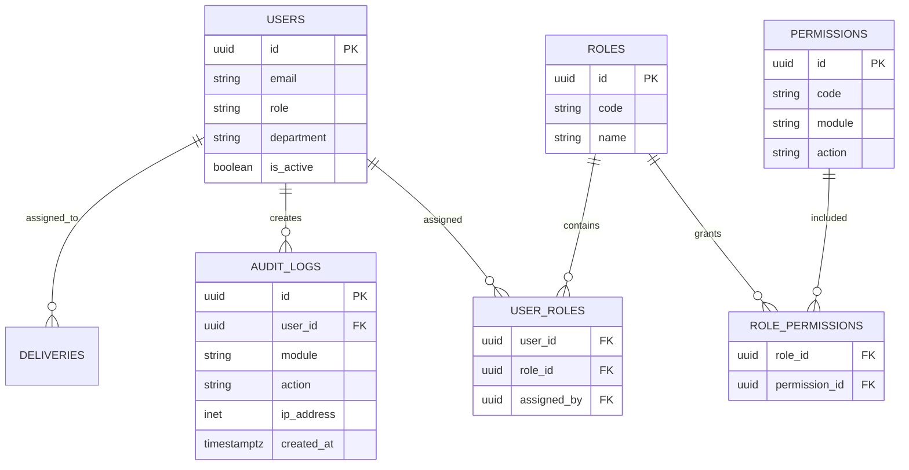

# Delivery RBAC

## Trust boundary

Supabase Auth identifies the session. The server resolves the corresponding
`public.users` row, then resolves `user_roles -> roles -> role_permissions ->
permissions` with the service-role client. Browser storage and the
`safawala_user` cookie are used only to improve navigation and hide controls;
they never grant access.

## Permission matrix

| Capability | Delivery staff | Franchise admin | Super admin |
| --- | ---: | ---: | ---: |
| `delivery.view` | yes | yes | yes |
| `delivery.update` | yes | yes | yes |
| Inventory, accounts, HR | no | yes | yes |
| `/users`, `/roles`, `/permissions`, `/settings` | no | policy-dependent | yes |

Delivery staff are restricted to `/portal/delivery` (and its child routes).
Changing the URL cannot bypass the server or API checks.

## Relational model



The migration `supabase/migrations/20260730000001_add_delivery_rbac.sql`
creates `delivery_staff`, seeds `delivery.view` and `delivery.update`, links
the role, and migrates `delivery@safawala.com` to `department='delivery'`.
Apply both RBAC migrations in the Supabase SQL editor before enabling the
production login.

## API contract

| Endpoint family | Required permission |
| --- | --- |
| `GET /api/deliveries`, `GET /api/deliveries/:id`, staff reads | `delivery.view` |
| Create/update/status/return/handover/photo/signature/staff assignment | `delivery.update` |
| Delete a delivery | `franchise_admin` (or super admin) |

Each handler calls `authenticateRequest` and fails closed with `401` or `403`.
The existing audit logger stores login/logout and can write delivery actions
to `audit_logs` with user, module, action, resource, IP, user agent and time.

## Frontend protection

`lib/portal-config.ts` marks each Delivery tab with `delivery.view` and the
sidebar filters tabs by the effective permission set. Delivery detail/status
controls are hidden for view-only users. This is presentation-only; the API
checks remain authoritative.

## Session/security checklist

- Use Supabase Auth sessions and server-side `getUser` validation.
- Keep the service-role key server-only; never expose it to client bundles.
- Enable RLS on RBAC and audit tables; permit users to read only their own
  assignment/audit rows.
- Add refresh-token rotation, password reset, MFA and inactivity timeout in
  Supabase Auth settings.
- Rate-limit login attempts and record failed attempts/device metadata.
- Treat missing RBAC tables or lookup errors as a staged rollout fallback only;
  once the migration is applied, relational assignments are authoritative.

## Recommended structure

```text
lib/auth-middleware.ts       # session + server permission resolution
lib/rbac.ts                  # reusable permission/audit helpers
lib/portal-config.ts         # permission-aware navigation
middleware.ts                # route boundary and login redirects
app/api/deliveries/**        # every delivery API authorization check
app/portal/delivery/**       # Delivery UI
supabase/migrations/*rbac*   # roles, permissions, assignments, audit logs
```
